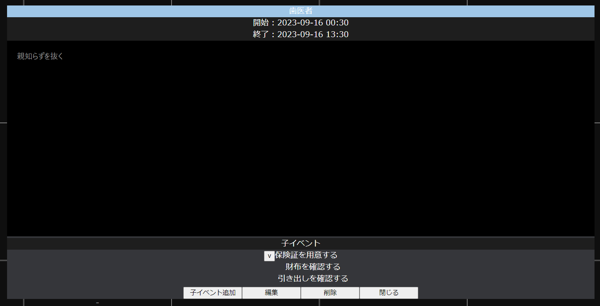

# todoApp
### Backend Repository
- https://github.com/T448/todoApp_backend

### Frontend Repository
- https://github.com/T448/todoApp_frontend

# Roadmap
- V1.0 
    - Calendar View
    - List View
    - Timeline View
    - Gantt Chart
    - Project Sharing
- V2.0
    - AI Manager

# Directory
```
.
├── docker/
│   ├── mysql/
│   ├── redis/
│   ├── redisinsight/
│   ├── spring/
│   ├── vue/
│   └── docker-compose.yml
├── .devcontainer/
│   ├── backend/
│   └── frontend/
├── todoApp_backend/
├── todoApp_frontend/
├── .gitignore
└── README.md

```

# How to build development  environment
1. 本リポジトリをcloneする。`todoApp`ディレクトリが出現する。
2. `todoApp`ディレクトリに移動し、[backend](https://github.com/T448/todoApp_backend)と[frontend](https://github.com/T448/todoApp_frontend)のレポジトリをcloneする。
3. `docker/`で`docker-compose up`
4. vscodeで`todoApp`フォルダを開く。
5. `ctrl + shift + p`でコマンドパレットを開き、`コンテナーで再度開く`→`spring`を選択する。
6. 同様に別windowでコマンドパレットを開き、`コンテナーで再度開く`→`vue`を選択する。

# API仕様書
- [project](https://t448.github.io/todoApp/swagger-ui/?q=API_project.yml)
- [event](https://t448.github.io/todoApp/swagger-ui/?q=API_event.yml)
- [memo](https://t448.github.io/todoApp/swagger-ui/?q=API_memo_template.yml)


# 機能
## 全体像(login前)


右上のボタンをクリックし、Googleでログインする。

---
## 全体像(login後)


---
## サイドバー


左のアイコンは上から順に
- ホームボタン(機能未実装)
- 通知ボタン(機能未実装)
- アカウント情報表示ボタン(機能未実装)
- 検索ボタン(機能未実装)
- 同期ボタン(Googleカレンダーと本アプリのDBの同期を手動で行うためのボタン。廃止予定。)
- 設定ボタン(機能未実装)
- ログアウトボタン(機能未実装)

右側はプロジェクトリスト。GoogleCalendarのカレンダーと対応している。`+`ボタンを押すとプロジェクト追加ダイアログが表示される。プロパティ名をクリックするとプロジェクト詳細ダイアログが表示される。(未実装)

---
## プロジェクト追加ダイアログ


プロジェクト名(必須)とメモを入力し、追加ボタンを押すとプロジェクトが追加される。同名のカレンダーがGoogle Calendarにも追加される。

---
## イベント詳細ダイアログ


イベント名、開始日時、終了日時、メモが表示される。子イベントがあれば子イベントのリストも表示される。



子イベントに子イベントがあるときは、子イベント名の左のボタンを押すことで展開することができる。
子イベント名をクリックすると、その子イベントの詳細ダイアログが表示される。


編集ボタンを押すと編集モードになる。イベント名、開始日時、終了日時、メモの編集ができる。メモはテンプレートを選択することができる。

---
## イベント追加ダイアログ


イベント名、開始日時、終了日時、メモの入力、プロジェクトの選択をし、追加ボタンを押すことでイベントの追加ができる。ここで追加したイベントはGoogleCalendarにも反映される。このダイアログはカレンダーの右上の+ボタン、カレンダーの各セルの-の上にマウスをのせた時に現れる+ボタン、イベント詳細ダイアログの子イベントを追加ボタンをクリックしたときに表示される。

---
## メモ用テンプレート追加・編集ダイアログ


メモのテンプレートの名前、本文の追加・編集を行う。カレンダーの右上の`add template`ボタンをクリックすると表示される。

---
## 表示モード切り替え機能(未実装)


カレンダー以外は未実装である。以下は簡単なUI案。

### List


### Kanban


### GanttChart

