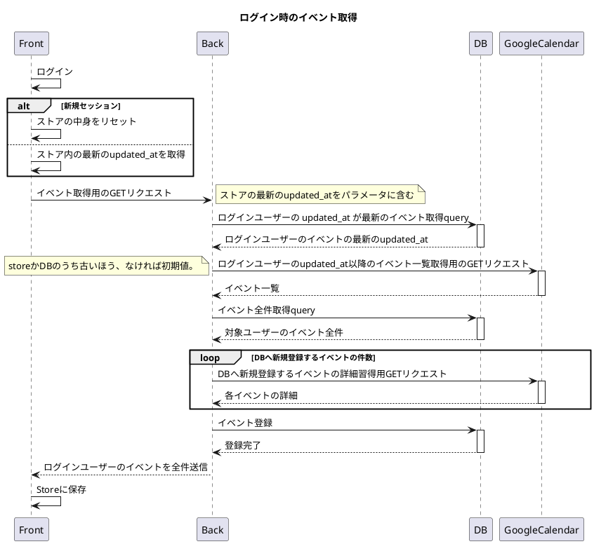

# google calendar のイベントを本アプリのカレンダーに表示する機能の実装

- イベントは本アプリから作成したものとGoogleCalendarから作成したものの2種類存在する。
- `General`というprojectを用意する。
- GoogleCalendarで作成したものは基本的にこのプロジェクト配下とする。
- 本アプリから作成するときも、`General`を選択することはできる。
- `General`の色はGoogleCalendarのそのユーザーのdefaultの色とする。
- GoogleCalendarAPIでイベント一覧を取得した後、取得したものとDBの内容を比較し、DBへの新規追加対象と更新対象とに分ける。(GoogleCalendarで作成したイベントは新規追加対象となる。)
- 新規追加対象はGoogleCalendarの詳細取得APIでそのイベントの色を取得する。
- 色をもとにプロジェクトを特定し、DBに追加する。

# シーケンス図

### あとで考える必要のあること
- ユーザーのdefaultの色を取得する必要がある。
- どこかのタイミングで(ログイン時とそれ以外)更新する必要がある。
- 詳細取得APIのレートリミットを調べる。色は一覧取得のレスポンスに含まれないため、新規追加対象の数だけリクエストを送らなくてはならない。厳しいようであれば、全部Generalにする。
